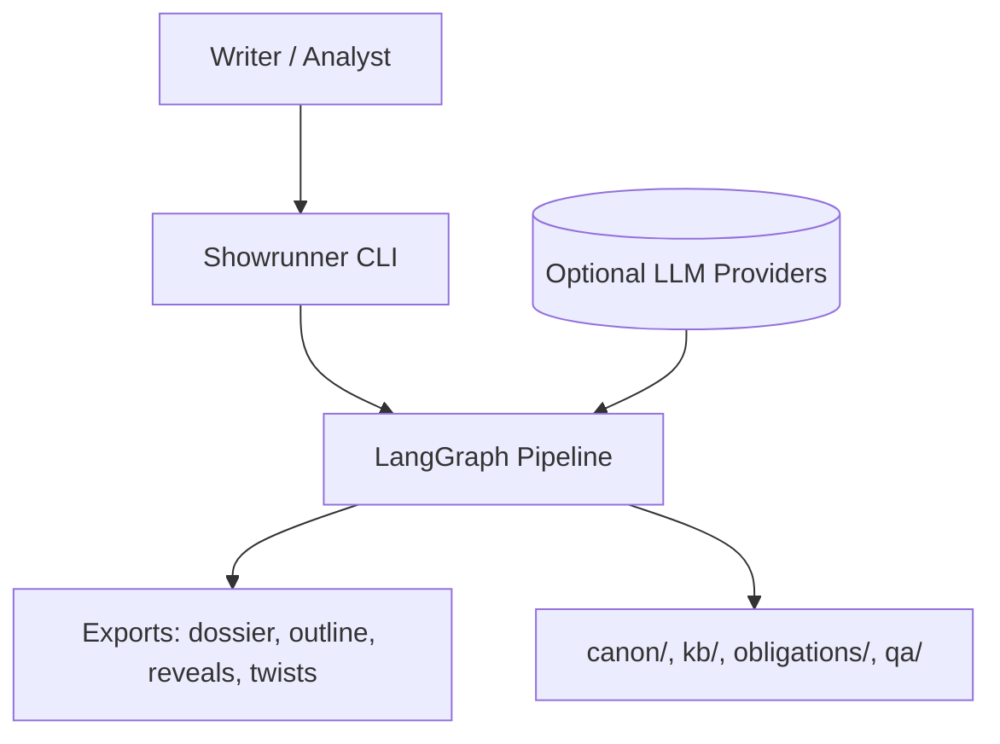
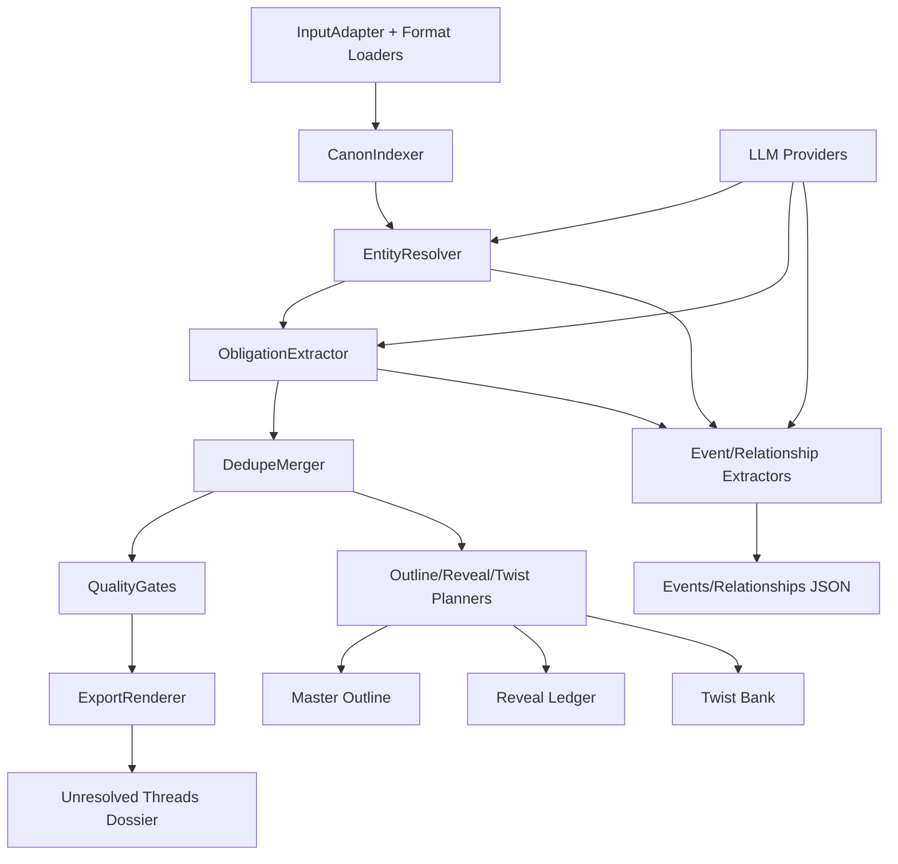

# Architecture

## Overview
Showrunner is a contract-driven LangGraph pipeline that ingests narrative corpora, builds a canon substrate (passages, entities, obligations, evidence), and exports writer-facing planning artifacts. The MVP produces an Unresolved Threads Dossier. The v0.2+ roadmap adds outline planning, reveal ledger, and twist bank generation. LLM usage is optional and pluggable via providers, with deterministic, offline defaults.

## Components

### 1. Input and Normalization
- InputAdapter selects file or folder ingestion.
- Format loaders normalize text from .txt, .md/.markdown, .docx, and .pdf.
- Each file becomes one DocumentUnit; paragraph segmentation happens in the canon indexer.

### 2. Canon Indexer
- Segments DocumentUnit into paragraph passages.
- Persists passages to SQLite and JSONL for deterministic replay.

### 3. Entity Resolver
- Extracts entities and aliases.
- Produces evidence anchors for entity mentions.

### 4. Obligation Extractor
- Extracts obligations across categories (prophecies, mysteries, plot threads, character arcs).
- Emits evidence anchors for each obligation.

### 5. Dedupe Merger
- Merges duplicate obligations and creates graph edges for traceability.

### 6. Quality Gates
- Validates schemas and referential integrity.
- Enforces evidence requirements and contradiction warnings.

### 7. Export Renderer
- Renders Unresolved Threads Dossier.
- Writes exports to disk with deterministic ordering.

### 8. Provider Harness
- LLMProviderProtocol defines complete and structured completion methods.
- RuleBasedProvider is default; Anthropic/OpenAI are optional via API keys.

### 9. Planning Modules (v0.2+)
- Outline planner produces master outline with convergence points and bridging beats.
- Reveal ledger planner produces mysteries and candidate truths.
- Twist bank planner produces twist proposals with evidence congruence.

### 10. Passive Mode Hooks (v1)
- Pre-commit detects changed files and runs incremental analysis.
- Post-commit updates the review queue.

### 11. Wiki Extraction (v1+)
- Event extractor emits canonical events with evidence anchors.
- Relationship extractor emits entity relationships with evidence anchors.
- StoryTime and StoryOrder provide in-world time and narrative order alongside real-world creation time.
- Wiki exports are written as JSON artifacts for UI and graph ingestion.
- Events and relationships must reference existing evidence anchors (no new anchors generated in v1).
- Outputs are stored under `output_dir/wiki/` as `events.json` and `relationships.json`.

## Data Flow
1. InputAdapter loads DocumentUnit list.
2. CanonIndexer segments passages and persists canon artifacts.
3. EntityResolver extracts entities and aliases.
4. ObligationExtractor emits obligations and anchors.
5. DedupeMerger merges obligations and writes obligation graph edges.
6. QualityGates validate artifacts; on pass, ExportRenderer renders dossier.
7. Planning modules consume obligations/entities/anchors to generate outline, reveal ledger, and twist bank outputs.
8. Wiki extractors consume passages/entities/obligations/anchors to emit events and relationships with provenance.
9. Pipeline writes wiki artifacts to `output_dir/wiki/events.json` and `output_dir/wiki/relationships.json`.

## Technology Stack
- Python 3.14
- Pydantic v2 for contracts
- LangGraph for pipeline orchestration
- Optional LangChain integrations for LLM providers
- SQLite for canon index persistence

## Diagrams

### System Context

### Component Diagram

## Data Model (Core)
- DocumentUnit -> PassageRecord -> EvidenceAnchor
- Entity, AliasEntry
- Obligation, ObligationGraphEdge
- Finding, RunManifest
- OutlineSection, ConvergencePoint, Beat (v0.2)
- RevealEntry, CandidateTruth (v0.3)
- TwistProposal (v0.4)
- StoryTime, StoryOrder, Event, Relationship (v1+)
