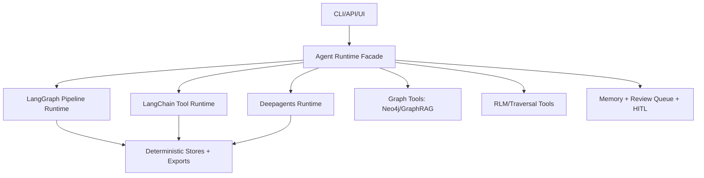

# LangGraph + LangChain + Deepagents Integration Plan

## Purpose
Define a concrete implementation sequence to evolve Showrunner from the current
deterministic LangGraph pipeline into a deeper agent runtime while preserving
evidence gates, schema contracts, and reproducibility.

## Baseline (Current)

| Capability | Status |
|---|---|
| LangGraph orchestration pipeline | Implemented |
| LangChain provider wrappers | Implemented |
| V0.1-V0.4 exports (dossier/outline/reveals/twists) | Implemented |
| Neo4j data model + loader + core queries | Implemented |
| Minimal harness (`run_pipeline`, `list_artifacts`, `read_artifact`) | Implemented |
| Deepagents execution runtime | Not implemented |

## Integration Principles

1. Keep `ShowrunnerPipeline` as the deterministic source of truth.
2. Add agent runtimes as wrappers around pipeline + stores (not replacements).
3. Every runtime path must preserve:
   - evidence anchors,
   - contract validation,
   - reproducible artifact output.
4. LLM-backed paths remain optional and testable offline.
5. Tests-first for all `src/` changes.

## Target Runtime Architecture

## Phased Plan

### Parallel Track: Writer Interface (Code-OSS fork + extension)

Goal: provide a centralized writing surface without rebuilding editor basics.

1. Build a VS Code extension (works in Code-OSS and VSCodium):
   - Agent panel (webview) for prompts and outputs.
   - Commands: run agent, refresh artifacts, open dossier/outline/reveals/twists.
   - Optional file watcher to trigger incremental runs.
2. Add a lightweight API contract between UI and Showrunner:
   - `POST /api/agent/run`
   - `GET /api/agent/status`
   - `GET /api/exports/*` and `GET /api/qa/*`
3. Fork Code-OSS only for distribution control:
   - bundle the extension by default,
   - apply branding/defaults,
   - avoid editor core changes.

Acceptance:
1. Writer can draft in the editor and open agent outputs in the panel.
2. Agent outputs are read-only and evidence anchored.
3. No editor core patches required to ship V1.

---

### Phase 1: Runtime Facade and Dependency Hardening (V1.1)

Goal: standardize one runtime interface before adding deeper agent loops.

1. Pin and verify compatible versions for `langgraph`, `langchain`,
   `langchain-core`, and optional `deepagents`.
2. Add runtime interface:
   - `src/showrunner/agent/runtime.py`
   - `AgentRuntimeProtocol`
   - `RuntimeMode` (`pipeline`, `langchain`, `deepagents`)
3. Keep `AgentHarness` as the baseline runtime implementation.
4. Add contract tests for runtime protocol.

Acceptance:
1. Existing harness tests pass.
2. New runtime protocol tests pass.
3. `pytest`, `ruff`, `pyright` stay green.

---

### Phase 2: LangChain Runtime Integration (V1.2)

Goal: add a LangChain agent runtime that uses safe tools over existing pipeline
and artifacts.

1. Add tool wrappers under `src/showrunner/agent/tools.py`:
   - `run_pipeline`
   - `list_artifacts`
   - `read_artifact`
   - `query_graph` (read-only)
2. Add `src/showrunner/agent/langchain_runtime.py` implementing
   `AgentRuntimeProtocol`.
3. Add policy middleware:
   - block writes outside output roots,
   - enforce evidence/schema gate checks before any artifact mutation.
4. Add API route(s) for runtime-mode execution:
   - `POST /api/agent/run`
   - `GET /api/agent/status`

Acceptance:
1. Integration test: LangChain runtime can trigger a run and return export paths.
2. Integration test: read-only graph query tool works.
3. No regressions in pipeline outputs vs baseline.

---

### Phase 3: Deepagents Runtime Integration (V2.0 foundation)

Goal: add optional deepagents execution mode behind feature flags.

1. Add optional dependency group and runtime guard:
   - `SHOWRUNNER_AGENT_MODE=deepagents`
2. Implement `src/showrunner/agent/deepagents_runtime.py` using the same tool
   contract as LangChain runtime.
3. Add TODO/plan persistence:
   - `plans/agent_todos.json`
4. Add interruption hooks for HITL decisions:
   - canon write approvals,
   - contradiction-risk approvals.

Acceptance:
1. Runtime capability reports deepagents mode accurately.
2. Deepagents mode can complete a sample run using current tools.
3. HITL interruption/resume path covered by tests.

---

### Phase 4: Remaining Tooling Integration

Goal: integrate the planned research/tooling layers without breaking determinism.

1. Graph tooling completion:
   - production-ready query adapter over `src/showrunner/graph/queries.py`
   - incremental sync wired to hooks.
2. Agentic traversal + RLM layer:
   - `src/showrunner/rlm/repl_executor.py`
   - retrieval budget controls + evidence-first query expansion.
3. Temporal memory:
   - store entity/event/relationship state transitions by story time and run time.
4. Multi-agent evaluation layer:
   - score candidates by canon/continuity/theme/plausibility.
5. Export alignment:
   - all generated outlines/reveals/twists must trace to obligations/evidence.

Acceptance:
1. Multi-hop query tests pass.
2. Timeline consistency tests pass across multiple runs.
3. Candidate ranking tests pass with reproducible scoring.

---

### Phase 5: CI and Observability Tightening

Goal: prevent runtime drift and keep all modes verifiable.

1. Add CI matrix by runtime mode:
   - pipeline mode (required),
   - langchain mode (required),
   - deepagents mode (optional/allowed-fail until stable, then required).
2. Add telemetry artifacts:
   - `tool_call_audit.jsonl`
   - `runtime_trace.json`
3. Add parity tests:
   - same input corpus must preserve core obligations/evidence across runtimes.

Acceptance:
1. CI fails on runtime contract drift.
2. CI fails when v0.1-v0.4 exports are missing/empty.
3. Runtime traces produced for each integration test run.

## Work Units (Parallelizable)

| Unit | Agent | Depends On | Provides | Est. |
|---|---|---|---|---|
| 1. Runtime protocol + mode enum | tdd-oop | - | `AgentRuntimeProtocol` | 2h |
| 2. Tool contract wrappers | tdd-oop | 1 | Safe runtime tools | 3h |
| 3. LangChain runtime adapter | api-layer | 1,2 | `langchain` runtime mode | 4h |
| 4. Agent API endpoints | api-layer | 3 | `/api/agent/*` endpoints | 3h |
| 5. Deepagents adapter scaffold | tdd-oop | 1,2 | `deepagents` mode wrapper | 3h |
| 6. HITL interruption layer | tdd-oop | 4,5 | Approval/resume hooks | 3h |
| 7. Graph tool runtime integration | data-models | 2 | Read-only graph tools | 3h |
| 8. RLM/traversal module scaffold | data-models | 2,7 | Retrieval/traversal tools | 4h |
| 9. Temporal memory store | data-models | 7,8 | Timeline memory backend | 4h |
| 10. CI runtime matrix + parity tests | devops | 3,5,7 | Runtime-mode gates | 3h |

## Definition of Done

1. LangGraph + LangChain + Deepagents modes available behind one runtime facade.
2. All modes preserve evidence-first contract and deterministic artifacts.
3. v0.1-v0.4 outputs remain CI-enforced.
4. Runtime-specific integration tests and traces are in CI.

## Immediate Next Step

Execute Phase 1 only, then re-evaluate before starting Phase 2.
